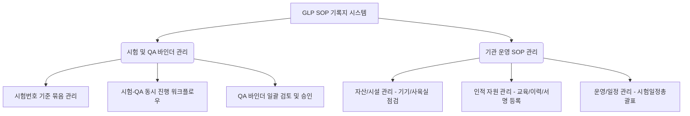

# GLP SOP & 기록지 통합 관리 아키텍처 제안서 (개정본)

본 제안서는 피드백을 반영하여 기관 내의 세 가지 핵심 SOP 범주(**시험 SOP**, **QA SOP**, **운영 SOP**)의 특성에 맞춰 기록지를 체계적으로 분류하고, 실제 GLP 업무 방식(시험과 QA의 동시 진행 및 QA의 일괄 검토 프로세스)을 반영한 아키텍처 및 UI/UX 설계 방안을 다룹니다.

---

## 1. 핵심 개념: 시험 중심(Study-Centric) vs 자원·일정·인원 중심(Operational)



### ① 시험 및 QA SOP (시험-QA 바인더 관리)
* **시험번호 기준 바인더(Binder):** 하나의 시험번호(Study Number) 하에서 수행되는 모든 시험 기록과 QA 점검 이력을 하나의 디지털 바인더로 묶습니다.
* **시험 & QA 동시 진행:** 시험원들이 시험 단계별로 기록지를 작성하는 동안, QA원은 병행하여 해당 시험의 점검 계획(QA Audit Plan)을 수립하고 점검을 준비합니다.
* **QA 일괄 검토 프로세스:** 각 기록지마다 QA가 개별 승인을 하는 것이 아닙니다. 시험이 완료되어 바인더가 **"QA 검토 대기(Submitted for QA)"** 상태가 되면, QA가 전체 문서를 일괄 검토한 뒤 `신뢰성보증확인서(QA Statement)`에 최종 서명함으로써 바인더를 영구 봉인합니다.

### ② 운영 SOP (다차원 운영 데이터 관리)
* **자산/시설 관리 (Assets/Facilities):** 기기 일상점검표(저울, 피펫 등), 시설 온습도 점검표 등 기기/위치 중심 데이터.
* **인적 자원 관리 (Personnel/HR):** 개인이력서(CV), 교육보고서/평가서, 서명등록대장 등 사람(연구원) 중심 데이터.
* **운영/일정 관리 (Operations & scheduling):** 시험일정총괄표(Master Schedule), 출입 기록 등 타임라인/일정 중심 데이터.

---

## 2. 확장 데이터 모델 및 바인더 라이프사이클

### ① 바인더 라이프사이클 (Status Flow)

```
[Ongoing (시험 진행)] -> [Submitted (QA 제출)] -> [QA Auditing (QA 점검)] -> [Completed (최종 봉인)]
```

1. **Ongoing (시험 진행):**
   - 시험원들은 바인더 내부의 개별 PDF 기록지를 실시간으로 기입하고 **작성자 서명**을 완료합니다.
   - QA 팀은 이 단계에서 해당 시험번호에 매핑된 `시험위주의점검계획서(QA-002)`를 병행하여 작성합니다.
2. **Submitted (QA 제출):**
   - 시험책임자(SD)가 모든 시험 기록지의 완결성을 확인하고 최종 서명하여 바인더 전체를 QA팀에 검토 요청합니다.
3. **QA Auditing (QA 점검):**
   - QA원은 바인더 전체를 열람하며 데이터의 무결성 및 SOP 준수 여부를 검토합니다.
   - 지적 사항이 있을 경우 수정 요청을 보내며, 시험책임자가 취선(`StrikeThrough`) 및 이력 작성을 완료하면 재검토합니다.
4. **Completed (최종 봉인):**
   - 검토 완료 후 QA원이 `신뢰성보증확인서(QA Statement)`에 전자서명을 함으로써 바인더 전체가 **수정 불가(Read-Only)** 상태로 봉인됩니다.

### ② 운영 데이터 모델 확장 (`recordEntries`)
기록지가 시험에 종속되는지 혹은 운영(자격, 일정, 기기)에 매핑되는지에 따라 외래키를 명확히 매핑합니다.
```typescript
interface RecordEntry {
  id: string;
  sopId: string;
  sopNumber: string;
  formTitle: string;
  
  // ─── 분류 및 매핑 카테고리 ───
  categoryType: "test" | "qa" | "operational";
  
  studyNumber?: string;   // 시험 및 QA 기록지인 경우 필수 (예: "ECT-2026-001")
  
  // 운영 SOP의 하위 매핑 데이터
  equipmentId?: string;   // 자산/시설 일지용 (기기 관리번호, 예: "BAL-001")
  locationId?: string;    // 시설 관리번호 (예: "ROOM-102")
  employeeId?: string;    // 인적 자원 일지용 (사번/연구원 ID, 예: "EMP-202401")
  scheduleYearMonth?: string; // 총괄표/일정 일지용 (예: "2026-06")
  
  status: "draft" | "author_signed" | "complete";
  drawings: Record<number, string>;
  // ... (필기 및 텍스트 데이터)
}
```

---

## 3. UI/UX 구현 아이디어

### 🖥️ 화면 설계 Mockup

#### [화면 1] 시험/QA 바인더 작업공간 (Study Binder Workspace)
연구원과 QA원이 같은 시험번호 공간을 공유하지만 역할에 따라 집중하는 영역이 다릅니다.
```
┌────────────────────────────────────────────────────────┐
│  📂 시험 바인더: ECT-2026-001                          │
│  [상태: QA 검토 대기]  시험책임자: 홍길동  QA원: 김철수   │
├──────────────────────────┬─────────────────────────────┤
│ 📋 시험원 기록지 리스트  │ 🔍 QA 점검 리스트 (일괄 검토) │
│ - [완료] 어류 순화기록서 │ - 점검구분: 시험위주의 점검 │
│ - [완료] 어체 측정기록서 │ - 점검단계: 시험물질 노출   │
│ - [완료] 독성시험 기록서 │ - [검토완료] 전체 문서 검토 │
│                          │                             │
│ * 시험책임자 최종 서명:  │ * QA 최종 신뢰성보증 서명:  │
│   ✍️ 홍길동 (서명완료)   │   [ 대기 중 - 최종 서명 ]  │
└──────────────────────────┴─────────────────────────────┘
```

#### [화면 2] 다차원 운영 SOP 작업공간 (Operational Space)
기기뿐 아니라 인력, 일정 관련 문서를 탭 형태로 구성하여 통합 관리합니다.
```
┌────────────────────────────────────────────────────────┐
│  🛠️ 기관 운영 관리 대시보드                           │
├────────────────────────────────────────────────────────┤
│ [📟 기기/시설]   [👤 인적 자원 CV]   [📅 시험일정총괄표] │
├────────────────────────────────────────────────────────┤
│  👤 인원 자격 및 이력 관리                             │
│  - [인원 선택: 이몽룡 연구원]                          │
│    ├─ 📄 개인이력서 (CV) - [최종 갱신: 2026-05]        │
│    ├─ ✍️ 서명등록대장 - [등록 완료]                    │
│    └─ 🎓 연간 교육훈련 보고서 - [2026년 2분기 완료]    │
│                                                        │
│  📅 시험일정총괄표                                     │
│  - [2026년 06월 총괄표]                                │
│    └─ 📄 일정표 PDF - [수정 완료 및 서명 완료]         │
└────────────────────────────────────────────────────────┘
```

---

## 4. 구현 로드맵

1. **1단계: 카테고리 기반 아키텍처 설계 (SOP & DB 매핑)**
   - 기록지 등록 시 `categoryType`에 따라 알맞은 메타데이터(사번, 연월, 기기번호 등)를 바인딩하도록 테이블 구조를 변경합니다.
2. **2단계: 시험 바인더 최종 승인 및 락(Lock) 기능 개발**
   - 시험책임자의 승인 서명 시점까지는 시험원이 자유롭게 일지를 작성하게 두고, 승인 완료 후에는 전체 문서를 읽기 전용 상태로 전환하여 QA팀에 전달하는 파이프라인을 구축합니다.
   - QA 검토 및 최종 신뢰성보증확인 서명 시 전체 바인더를 영구 락 처리합니다.
3. **3단계: 운영 카테고리별 랜딩 페이지 구축**
   - 사원 번호를 스캔하여 개인이력서와 이몽룡 연구원의 교육이력/서명대장으로 바로 연결되는 HR 뷰를 제공합니다.
   - 총괄표 월별 선택 기능 및 기기/시설의 캘린더 일지 조회 페이지를 작성합니다.
